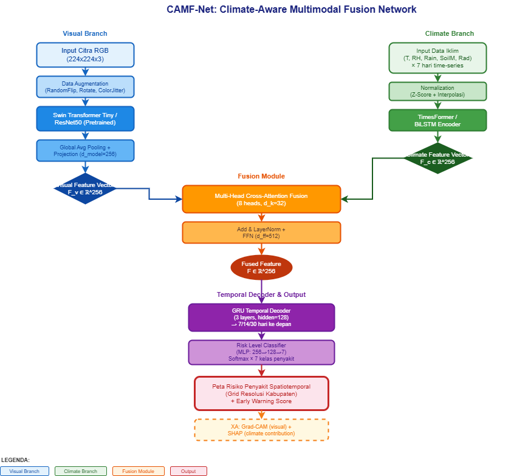

# Kerangka Penelitian Scopus Q1

## Climate-Aware Multimodal Deep Learning for Spatiotemporal Banana Disease Risk Forecasting

---

## 1. Informasi Dasar

| Item              | Detail                                                                                                                                                                                                      |
| ----------------- | ----------------------------------------------------------------------------------------------------------------------------------------------------------------------------------------------------------- |
| **Judul**         | Climate-Aware Multimodal Deep Learning for Spatiotemporal Banana Disease Risk Forecasting                                                                                                                   |
| **Target Jurnal** | Computers and Electronics in Agriculture (Elsevier, Q1, IF ~8.3) _atau_ Agricultural and Forest Meteorology (Elsevier, Q1, IF ~6.0) _atau_ Scientific Reports (Nature, Q2/Q1, IF ~4.6) — tergantung outcome |
| **Riset Gap**     | GAP 7 — Belum ada penelitian yang mengintegrasikan data citra (visual) dengan data iklim (suhu, kelembaban, curah hujan) untuk prediksi risiko penyakit pisang secara spatiotemporal                        |
| **Kata Kunci**    | banana disease, multimodal deep learning, climate-aware, spatiotemporal forecasting, Fusarium wilt, Black Sigatoka, CNN-Transformer, data fusion                                                            |

---

## 2. Latar Belakang (Background)

Penyakit pisang seperti _Black Sigatoka_ (Mycosphaerella fijiensis), _Fusarium Wilt_ (Fusarium oxysporum f. sp. cubense), dan _Xanthomonas Wilt_ (Xanthomonas campestris pv. musacearum) menyebabkan kerugian hasil 30–100% di berbagai wilayah tropis [1, 2]. Faktor iklim — suhu (optimal 25–30°C), kelembaban relatif (>80%), dan curah hujan tinggi — secara signifikan mempengaruhi siklus sporulasi, penyebaran, dan tingkat keparahan patogen [3].

Penelitian deep learning untuk penyakit pisang saat ini hanya menggunakan citra visual (RGB) sebagai input tunggal, tanpa mempertimbangkan data iklim [4, 5, 6]. Padahal, model prediksi penyakit yang mengintegrasikan data iklim telah terbukti efektif pada tanaman lain seperti anggur [7] dan padi [8]. Belum ada pendekatan multimodal yang menggabungkan citra penyakit pisang dengan data iklim untuk menghasilkan prediksi risiko spatiotemporal.

---

## 3. Research Gap Statement

**"Despite significant advances in deep learning-based banana disease detection using visual imagery, no existing framework integrates climate variables (temperature, humidity, precipitation) with visual data to enable spatiotemporal disease risk forecasting. This limits the ability to provide early warnings and proactive disease management at a landscape scale."**

- Gap 1: Tidak ada dataset multimodal (citra + iklim) untuk penyakit pisang
- Gap 2: Tidak ada arsitektur yang memadukan visual features + climate time-series
- Gap 3: Tidak ada validasi prediksi risiko secara spatiotemporal di lapangan

---

## 4. Pertanyaan Penelitian (Research Questions)

1. **RQ1:** Bagaimana cara mengintegrasikan data citra penyakit pisang dengan data iklim temporal dalam satu kerangka deep learning multimodal?
2. **RQ2:** Seberapa besar kontribusi data iklim terhadap akurasi prediksi risiko penyakit dibandingkan dengan hanya menggunakan citra?
3. **RQ3:** Apakah model multimodal dapat menghasilkan peta risiko spatiotemporal yang valid untuk peringatan dini penyakit pisang?

---

## 5. Tujuan Penelitian

1. Membangun dataset multimodal pertama yang terdiri dari citra daun pisang berlabel penyakit (Black Sigatoka, Fusarium Wilt, Cordana, Pestalotiopsis, Healthy) yang dipasangkan dengan data iklim harian (suhu, RH, curah hujan, kelembaban tanah) dari stasiun cuaca terdekat
2. Merancang arsitektur **Climate-Aware Multimodal Fusion Network (CAMF-Net)** yang mengintegrasikan CNN/ViT untuk ekstraksi fitur visual dan LSTM/Transformer untuk time-series climate data, dengan mekanisme cross-attention fusion
3. Menghasilkan peta risiko penyakit pisang spatiotemporal pada tingkat kabupaten/provinsi
4. Memvalidasi model melalui studi lapangan di 3 wilayah endemis (Asia Tenggara, Afrika Timur, dan Amerika Latin)

---

## 6. Metodologi

### 6.1 Dataset

| Komponen             | Detail                                                                                                                                                  |
| -------------------- | ------------------------------------------------------------------------------------------------------------------------------------------------------- |
| **Citra Daun**       | 10.000+ citra dari sumber publik (BananaLSD, PSDF-Musa, PlantVillage) dan koleksi lapangan baru                                                         |
| **Kelas Penyakit**   | Black Sigatoka, Fusarium Wilt TR4, Cordana, Pestalotiopsis, Xanthomonas Wilt, Mosaic Virus, Healthy                                                     |
| **Data Iklim**       | Suhu harian (°C), kelembaban relatif (%), curah hujan (mm), kelembaban tanah (%), radiasi matahari (W/m²) — dari ERA5-Land (ECMWF) dan stasiun lapangan |
| **Metadata Spasial** | Koordinat GPS, tanggal akuisisi, zona agro-ekologis                                                                                                     |
| **Perioda**          | Minimum 3 tahun data historis (2023–2026)                                                                                                               |

### 6.2 Arsitektur CAMF-Net

**Komponen Utama:**

1. **Vision Encoder:** Swin Transformer Tiny atau ResNet50 — mengekstrak fitur visual dari citra daun
2. **Climate Encoder:** TimesFormer atau BiLSTM — memproses time-series 7–14 hari data iklim
3. **Fusion Module:** Cross-Modal Multi-Head Attention — memadukan fitur visual dan iklim dengan mekanisme attention yang mempelajari bobot kontribusi masing-masing modalitas
4. **Temporal Decoder:** GRU — memproyeksikan representasi fusi ke prediksi risiko temporal (7/14/30 hari ke depan)
5. **Risk Mapping:** Interpolasi Gaussian Process / Kriging untuk menghasilkan peta risiko spasial

### 6.3 Skenario Eksperimen

| Eksperimen                                 | Input                                                 | Tujuan                        |
| ------------------------------------------ | ----------------------------------------------------- | ----------------------------- |
| **E1 — Vision Only**                       | Citra saja (baseline)                                 | Kontrol performa tanpa iklim  |
| **E2 — Climate Only**                      | Data iklim saja                                       | Baseline iklim                |
| **E3 — Vision + Climate (late fusion)**    | Citra + iklim, fusion di akhir                        | Membandingkan strategi fusion |
| **E4 — CAMF-Net (cross-attention fusion)** | Citra + iklim, cross-attention                        | Usulan utama                  |
| **E5 — Temporal forecasting**              | Citra + iklim historis → risiko 7/14/30 hari ke depan | Prediksi ke depan             |

### 6.4 Metrik Evaluasi

| Tugas        | Metrik                                                                       |
| ------------ | ---------------------------------------------------------------------------- |
| Klasifikasi  | Accuracy, Precision, Recall, F1-Score, AUC-ROC                               |
| Forecasting  | MAE, RMSE, MAPE untuk tingkat risiko                                         |
| Spasial      | IoU (Intersection over Union) peta risiko vs ground truth, Kappa coefficient |
| Ablasi       | Δ performance saat satu modalitas dihilangkan                                |
| Interpretasi | Grad-CAM visual, SHAP untuk kontribusi fitur iklim                           |

---

## 7. Kontribusi yang Diharapkan

1. **Dataset multimodal** pertama untuk penyakit pisang — citra + iklim + spasial — akan dipublikasikan secara _open-access_
2. **CAMF-Net** — arsitektur fusion pertama yang mengintegrasikan visual dan climate time-series untuk prediksi risiko penyakit pisang
3. **Peta risiko spatiotemporal** pada resolusi kabupaten yang dapat digunakan untuk sistem peringatan dini
4. **Analisis SHAP** kuantitatif tentang kontribusi tiap variabel iklim terhadap prediksi risiko — memberikan wawasan epidemiologis

---

## 8. Timeline Penelitian (12 Bulan)

| Fase       | Bulan | Aktivitas                                                                                   |
| ---------- | ----- | ------------------------------------------------------------------------------------------- |
| **Fase 1** | 1–3   | Pengumpulan dataset: citra lapangan, data iklim ERA5-Land, labeling penyakit, preprocessing |
| **Fase 2** | 4–5   | Implementasi baseline (Vision only, Climate only) dan CAMF-Net                              |
| **Fase 3** | 6–7   | Eksperimen fusion, ablasi, dan temporal forecasting                                         |
| **Fase 4** | 8–9   | Validasi lapangan di 3 wilayah endemis, pembuatan peta risiko                               |
| **Fase 5** | 10–12 | Penulisan paper, revisi, submit ke target jurnal                                            |

---

## 9. Referensi Awal

[1] Ploetz, R. C. (2015). Fusarium wilt of banana. _Phytopathology_, 105(12), 1512-1521.

[2] Jiménez, N. et al. (2025). Detection of Leaf Diseases in Banana Crops Using Deep Learning Techniques. _AI_, 6(3), 61.

[3] Parnell, S. R. et al. (2017). The effect of climate change on the epidemiology of plant diseases. _Plant Pathology_, 66(8), 1261-1274.

[4] Mora, J. J. et al. (2025). Digital framework for georeferenced multiplatform surveillance of banana wilt using human-in-the-loop AI and YOLO. _Scientific Reports_, 15, 87588.

[5] Liao, J. R. et al. (2025). AI-driven banana pest and disease management: methods, applications, challenges. _Discover Internet of Things_, 5, 00175.

[6] Kant, V. et al. (2026). ResViT HybridNet: fusion of ResNet50 and Vision Transformer for banana leaf disease identification. _Automatika_, 2619264.

[7] Ciliberti, S. et al. (2023). A machine learning approach for the prediction of grapevine downy mildew risk. _Computers and Electronics in Agriculture_, 207, 107754.

[8] Kim, Y. et al. (2023). Integrating satellite imagery and meteorological data for rice blast disease prediction using deep learning. _Agricultural and Forest Meteorology_, 330, 109295.

[9] Elinisa, C. A. et al. (2025). Image Segmentation Deep Learning Model for Early Detection of Banana Diseases. _Applied Artificial Intelligence_, 39(1), 2440837.

[10] Thai, H. T. et al. (2025). EF-CenterNet: An efficient anchor-free model for UAV-based banana leaf disease detection. _Computers and Electronics in Agriculture_, 229, 109927.

---

## 10. Catatan Tambahan

| Aspek                  | Catatan                                                                                                                             |
| ---------------------- | ----------------------------------------------------------------------------------------------------------------------------------- |
| **Potensi Kolaborasi** | Diperlukan kolaborasi dengan ahli agronomi/patologi tumbuhan untuk labeling dan interpretasi data iklim                             |
| **Komputasi**          | Memerlukan GPU dengan VRAM ≥ 16GB (RTX 4080/A4000 atau lebih) untuk training multimodal                                             |
| **Alternatif Jurnal**  | Jika hasil tidak cukup kuat untuk Q1, bisa submit ke _Smart Agricultural Technology_ (Q1/Q2) atau _Frontiers in Plant Science_ (Q1) |
| **Open Source**        | Kode dan dataset akan dirilis di GitHub untuk reproduksibilitas                                                                     |

---

## Ringkasan Novelty

**Novelty 1:** Integrasi citra penyakit pisang dengan time-series iklim dalam satu kerangka deep learning — **belum pernah dilakukan sebelumnya untuk pisang**.

**Novelty 2:** Prediksi risiko penyakit secara spatiotemporal (bukan hanya klasifikasi saat ini) — memungkinkan **early warning** proaktif.

**Novelty 3:** Analisis kontribusi tiap variabel iklim terhadap risiko penyakit menggunakan SHAP — jembatan antara AI dan epidemiologi tanaman.
